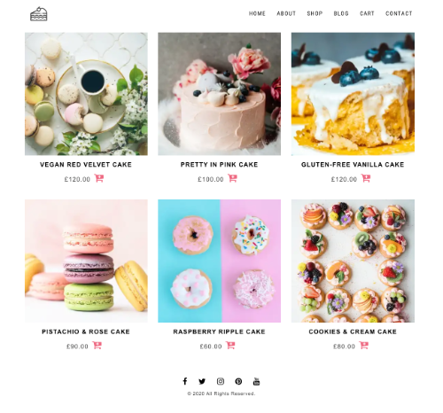

## Kēki 

> A Gatsbyjs Contentful Snipcart Starter

[Online Demo](https://keki.netlify.app/)

Kēki is a responsive eCommerce web application which allows users to order artisan cakes from the store.

It's built on Gastby.js with Contentful CMS (api-based headless CMS solution) and integration with Snipcart for checkout and payment process. The project is fully automated with a continuous deployment pipeline via Netlify. 



### Roadmap

* Add more tests
* Move pipeline to AWS Amplify
* Feature imporvement, including member system 

### Under the hood

* [Gastby](https://www.gatsbyjs.org/)
* [Contenful CMS](https://www.contentful.com/)
* [Snipcart](https://snipcart.com/)
* [Styled-components](https://github.com/styled-components/styled-components)
* [Vercel](https://vercel.com/)
  

### Getting start

Create `.env` on root.

```
CONTENTFUL_SPACE_ID = key
CONTENTFUL_ACCESS_TOKEN = Key
snipcart = Key
```

### Development

```bash
# To develop
yarn start

# To clear cache
yarn clean

# To build
yarn build
```

### Resources

* All images are from [Upsplash](https://unsplash.com/)
* SVG from [FlatIcon](https://www.flaticon.com/)
* [Google Webfont](https://fonts.google.com/)
* [FontAwesome](https://fontawesome.com/v4.7.0/)

### License

[](http://badges.mit-license.org)
